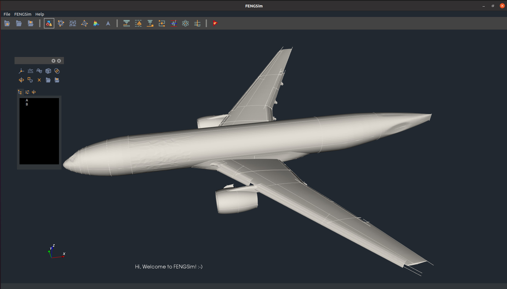
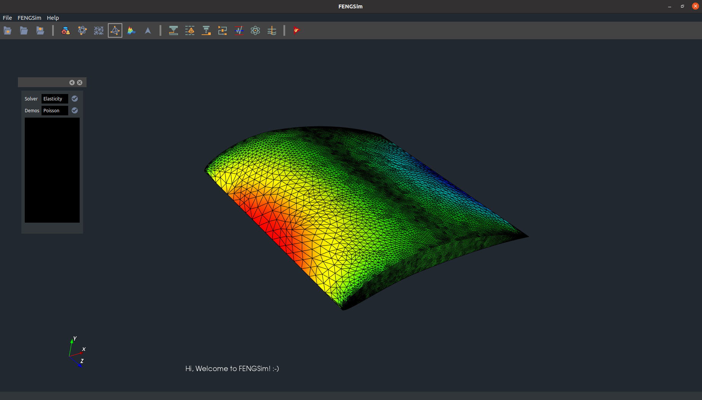
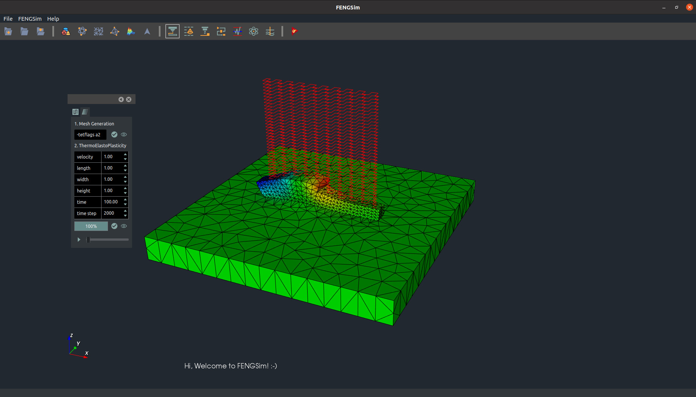
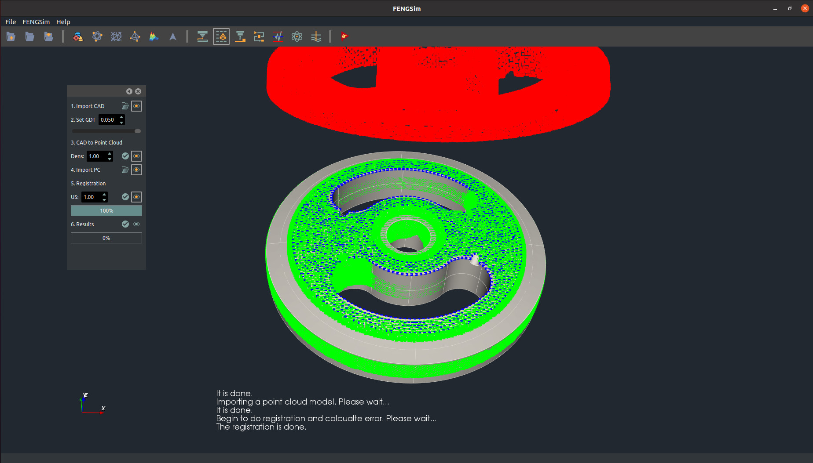
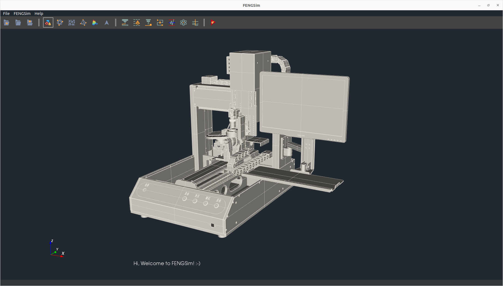
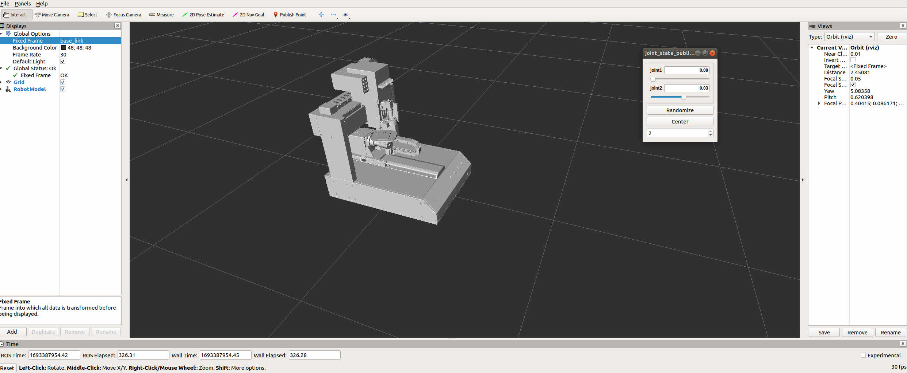
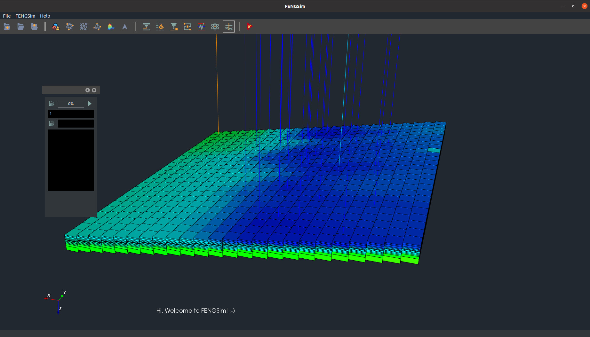
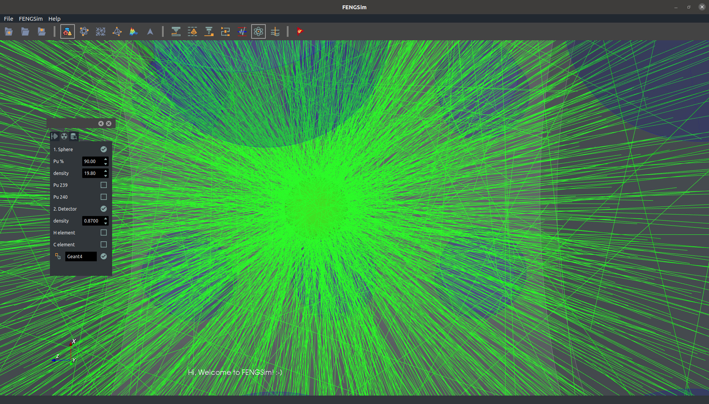
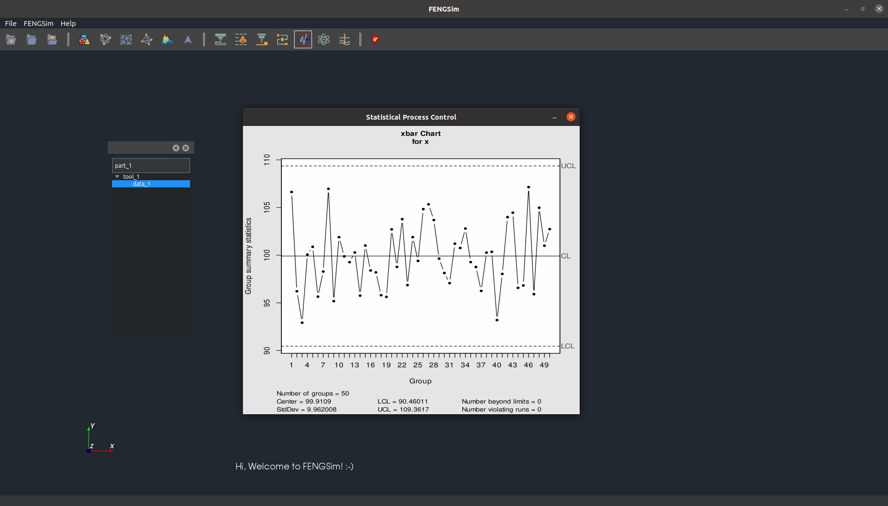

# OpenCAXPlus OS

# Install
1. Navigate to the OpenDigitalTwin-main/cli directory in your terminal/command prompt.
2. Run the install script by entering: ./install.sh
3. Once installation is complete, launch QtCreator with: ./qtcreator.sh
4. In QtCreator, open the FENGSim.pro project file located at: starters/FENGSim/FENGSim.pro
5. Build the prepost module project in QtCreator.
	
# Showcases

<!-- The logging library (spdlog) does not work with intel oneapi (classic) on mac, so you are expected to see different logging style for mac+intel vs other OS compiler combinations.

You shouldn't use any toolkit code from the framework.
Only use framework code from the toolkit if necessary, such as in the interface part of the toolkit. The core logic part of the toolkit should be as independent as possible. -->
