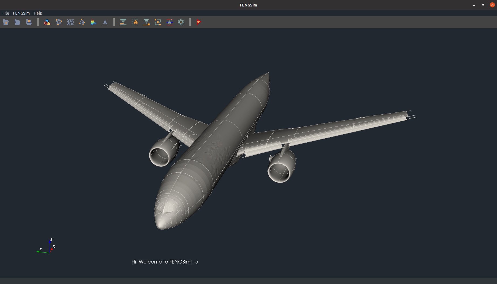

# OpenCAXPlus-SDK

Checkout the sdk [site](https://sdk.opencax.plus) for developer guide, user manuals and some examples.
Also, checkout our organization [landing page](https://opencax.plus) for more of our projects.

Our aim is to provide a SDK (software development kit) that does the tedious works in building an CAX application, while still grants developers full control of the core logic and being able to spawn an production ready application in no time.

## Definition

- **Framework**: In our case, framework is a skeleton of application. It defines rules for the SDK, so that various parts can be connected easily. It defines the procedures of how an application should be called. It setup the routine parts of an application for the users and expose certain slots to the user to customize, in other words, framework calls your function to build an executable. Framework is a combination of interface and lifecycle.
- **Toolkit**: Toolkit is a collection of software libraries. These are handy functions that you can call to save your developing time. Libraries in the toolkit must conform (at least partially) to the framework interface.

<!-- The logging library (spdlog) does not work with intel oneapi (classic) on mac, so you are expected to see different logging style for mac+intel vs other OS compiler combinations.

You shouldn't use any toolkit code from the framework.
Only use framework code from the toolkit if necessary, such as in the interface part of the toolkit. The core logic part of the toolkit should be as independent as possible. -->
