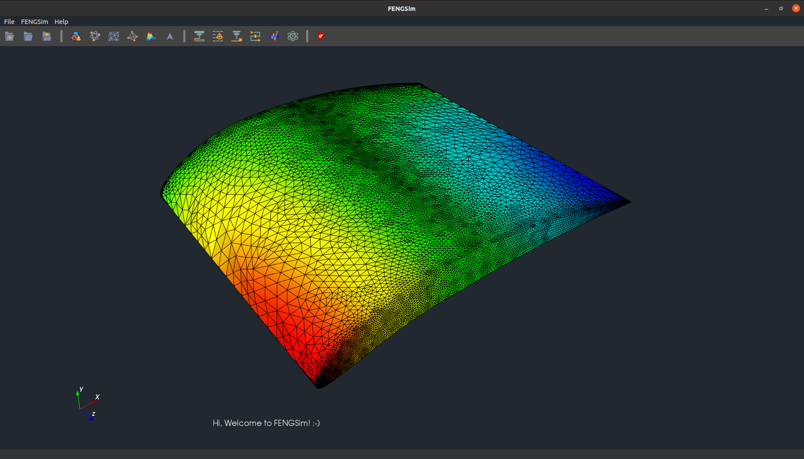

# OpenCAXPlus-SDK

The main goal of the OpenCAXPlus project is to provide an SDK (software development kit) that does the tedious work of building a CAX application. This includes but is not limited to
- creating wrappers that allow developers to use multiple open-source libraries seamlessly
- installing and linking necessary libraries
- providing GUI interface
- cross-platform project setup
- documentation/landing page setup
- automated CI/CD setup
- automated packaging and publishing

The SDK also aims to impose no rules on how developers should write their applications. Developers still have full control of the core logic of your application. Starting from our starter templates, developers can spawn a production-ready application in no time.

Check out the SDK [site](https://sdk.opencax.plus) for a developer guide, user manuals, and examples.
Also, check out our organization [landing page](https://opencax.plus) for more of our projects.

<!-- The logging library (spdlog) does not work with intel oneapi (classic) on mac, so you are expected to see different logging style for mac+intel vs other OS compiler combinations.

You shouldn't use any toolkit code from the framework.
Only use framework code from the toolkit if necessary, such as in the interface part of the toolkit. The core logic part of the toolkit should be as independent as possible. -->
